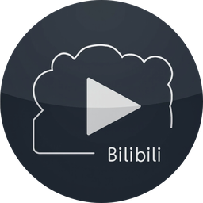
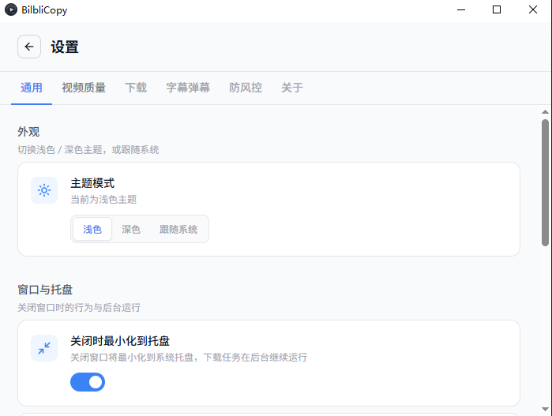
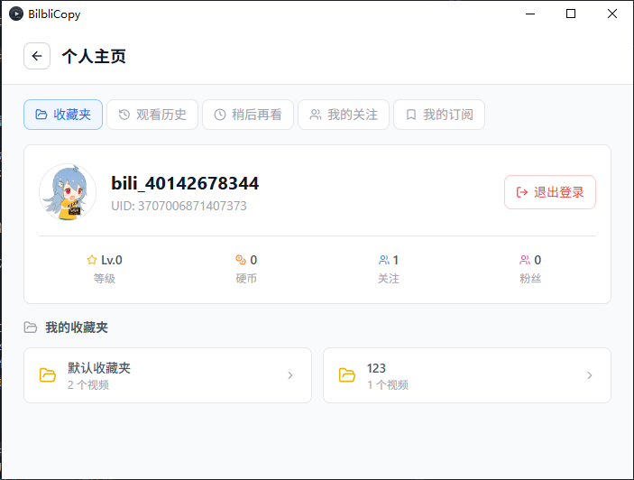

<p align="center">
  <a href="https://github.com/mkktop/bilbili_copy">
    
  </a>
</p>

<h1 align="center">BilbliCopy</h1>

<p align="center">
  A modern, lightweight desktop client for downloading videos from Bilibili. Built with Tauri 2 (Rust + React).
  <br />
  Fast · Clean UI · Multi-threaded · Built-in Player · Risk-control friendly
</p>

<p align="center">
  <a href="./README.zh-CN.md">简体中文</a>
  ·
  <a href="./README.md">English</a>
</p>

<p align="center">
  <a href="https://github.com/mkktop/bilbili_copy/releases/latest">
    
  </a>
  <a href="https://github.com/mkktop/bilbili_copy/releases/latest">
    
  </a>
  
  
  
  
  
</p>

<p align="center">
  <a href="#-features">Features</a>
  ·
  <a href="#-screenshots">Screenshots</a>
  ·
  <a href="#-installation">Installation</a>
  ·
  <a href="#-build-from-source">Build from Source</a>
  ·
  <a href="#-architecture">Architecture</a>
  ·
  <a href="#-contributing">Contributing</a>
</p>

---

> [!NOTE]
> This is a third-party, community-driven tool and is **not affiliated with, endorsed by, or sponsored by Bilibili**. Please use it in compliance with Bilibili's Terms of Service and your local laws. Download only content you are authorized to access.

## ✨ Features

### 📥 Downloading
- **Up to 8K / HDR / Dolby Vision** video quality, Hi-Res lossless & Dolby Atmos audio, configurable codec priority (AVC / HEVC / AV1)
- **Multi-threaded, resumable downloads** — pause, restart, or close the app mid-download; cross-session resume protected by stream fingerprints
- **Batch support** — multi-part videos, full bangumi seasons, collections, favorites, watch-later lists, and a UP's submissions; audio-only (m4a/mp3) and subtitle-only modes
- **Queue management** — configurable concurrency / speed limit, pause / resume / retry / priority, system notification on completion
- **Custom filename templates** — `{up}/{title} [{bvid}]` placeholders, auto-archiving by UP / collection
- **Extra attachments** — danmaku (ASS with adjustable font / speed / opacity), subtitle export (SRT / VTT), NFO metadata scraping (Kodi / Jellyfin / Emby ready)

### ▶️ Built-in Player
- Instant playback without downloading, quality switching on the fly, frame-accurate seeking (sidx index), auto-retry on weak networks
- Real-time danmaku, multi-language subtitles (incl. AI subtitles), 0.5x–2x speed, multi-part selection
- **Playlist mode** — auto-play next episode across uploads; pair with Weekly Highlights to binge a whole issue
- Resume position, mini player, system picture-in-picture, full keyboard shortcuts

### 🧭 Browse & Discover
- **Explore** — unified search (videos / UPs / bangumi / movies) + search history + Bilibili trending hot search
- **Rankings / Recommend / Regions / Following dynamics / Weekly Highlights** — five browse entries covering UGC and bangumi/movies
- **Personal center** — favorites / watch-later / watch history / bangumi subscriptions / following / collections, with virtualized long lists
- **UP homepage** — submissions and collections one click away, jump from any video detail
- **Interactions** — like / coin / favorite / one-click triple-action, comment browsing

### 📰 Article Reader
- Paste cv / opus links to read in-app with clean formatting (HTML whitelist sanitization)
- Export to Markdown or PDF (multi-page, full images)

### 🛡️ Account & Anti-Risk
- QR-code login, automatic cookie refresh, credentials stored locally only
- Configurable device fingerprint (GPU / resolution presets) and request throttling; in-app captcha dialog when risk-control is triggered
- Clear prompts for VIP / paid / member-only content — never mistakenly downloads a preview clip as the full video

### 🎨 Experience
- Light / dark / system themes; auto-detect pasted links, drag-and-drop link parsing
- Minimize to tray on close, background downloads; download statistics dashboard (count / size / duration)
- In-app auto-update; fully pooled API connections for fast browsing and parsing

## 📸 Screenshots

<table>
  <tr>
    <td width="33%" align="center"><b>Home — Parse & Queue</b></td>
    <td width="33%" align="center"><b>Settings</b></td>
    <td width="33%" align="center"><b>Personal Homepage</b></td>
  </tr>
  <tr>
    <td width="33%" align="center"></td>
    <td width="33%" align="center"></td>
    <td width="33%" align="center"></td>
  </tr>
  <tr>
    <td width="33%" align="center">Paste a link, parse it, and queue downloads.</td>
    <td width="33%" align="center">Quality, download, subtitles/danmaku, anti-risk, theme, tray.</td>
    <td width="33%" align="center">Favorites, watch history, watch later, follows, subscriptions.</td>
  </tr>
</table>

## 📦 Installation

### Option A — Download (recommended for most users)

1. Go to the [latest release](https://github.com/mkktop/bilbili_copy/releases/latest).
2. Download the `.msi` installer.
3. Run the installer and launch **BilbliCopy**.

The bundled `ffmpeg.exe` is included automatically — no extra setup needed.

### Option B — Build from source

See [Build from Source](#-build-from-source) below.

## 🚀 Build from Source

### Prerequisites

- [Node.js](https://nodejs.org/) 20+ and [pnpm](https://pnpm.io/) 9+
- [Rust](https://www.rust-lang.org/tools/install) (stable toolchain)
- Windows 10+ with [Microsoft C++ Build Tools](https://visualstudio.microsoft.com/visual-cpp-build-tools/) (or Visual Studio with the *Desktop development with C++* workload)
- [WiX Toolset 3.14](https://wixtoolset.org/) (for `.msi` packaging)

### Steps

```bash
# 1. Clone
git clone https://github.com/mkktop/bilbili_copy.git
cd bilbili_copy

# 2. Install frontend dependencies
pnpm install

# 3. Run in development (starts Vite + compiles Rust)
pnpm dev

# 4. Or build a production MSI installer
pnpm build
```

The installer will be generated under `src-tauri/target/release/bundle/`.

## 🏗️ Architecture

BilbliCopy is a **Tauri 2** application: a Rust backend handling all network and file I/O, with a React 18 (Vite + Tailwind CSS) frontend.

```
┌──────────────────────────────────────────────────────────┐
│                     Frontend (React 18)                    │
│   Views · Hooks · Contexts · Tailwind UI · lucide icons   │
└────────────────────────┬─────────────────────────────────┘
                         │  invoke() / events
┌────────────────────────▼─────────────────────────────────┐
│                    Backend (Rust)                          │
│  ┌──────────────┐   ┌──────────────┐   ┌──────────────┐  │
│  │  commands/   │   │  bilibili/   │   │ download_mgr │  │
│  │  (handlers)  │──▶│  (API logic) │   │ (scheduler)  │  │
│  └──────────────┘   └──────────────┘   └──────────────┘  │
│            Local state: SQLite · JSON · log               │
└──────────────────────────────────────────────────────────┘
```

- **`commands/`** — `#[tauri::command]` handlers; parameter validation and orchestration, registered in `lib.rs`.
- **`bilibili/`** — Core business logic, organized by Bilibili API domain (`passport`, `credential`, `playurl`, `pgc`, `wbi`, `danmaku`, `subtitle`, `nfo`, …).
- **`download_manager.rs`** — Decouples task submission from execution: priority queue, pause / cancel, concurrency semaphores.
- **`db.rs`** — SQLite via `rusqlite` (WAL mode), schema migrations stored inline.

> All Bilibili HTTP calls go through the Rust backend — the frontend never fetches Bilibili APIs directly.

Data files (`settings.json`, `credentials.json`, `data.db`, `app.log`) live next to the executable. See [CLAUDE.md](./CLAUDE.md) and [AGENTS.md](./AGENTS.md) for deeper developer notes.

## 🔧 Tech Stack

| Layer      | Technology                                             |
| ---------- | ------------------------------------------------------ |
| Framework  | Tauri 2                                                |
| Backend    | Rust 2021, tokio, reqwest, rusqlite, prost             |
| Frontend   | React 18, TypeScript, Vite 7                           |
| Styling    | Tailwind CSS 3                                         |
| Icons      | lucide-react                                           |
| Packaging  | WiX (MSI), bundled ffmpeg                              |
| Updates    | tauri-plugin-updater (GitHub Releases)                 |

## 🤝 Contributing

Contributions are welcome! Please note this repo currently has **no linter, formatter, or test suite** configured — keep changes clean and consistent with the surrounding code.

1. Fork the repository and create a feature branch.
2. Make your changes. Verify with `pnpm typecheck` and `cd src-tauri && cargo check`.
3. Open a Pull Request describing **what** and **why**.

For larger features, please open an issue first to discuss the design.

## 🗺️ Roadmap

- [ ] macOS / Linux builds
- [ ] More screenshot documentation
- [ ] Plugin / theme extensibility
- [ ] Additional metadata sources for NFO scraping

## ⚖️ License

This project is released under the **MIT License**. See [LICENSE](./LICENSE) for details.

## ⚠️ Disclaimer

BilbliCopy is an **unofficial, open-source project for personal study and technical exchange only**.

- It is **not affiliated with, endorsed by, or sponsored by Bilibili** or any of its affiliates.
- All video content, trademarks, and copyrights belong to Bilibili and the respective content creators.
- Users are solely responsible for complying with Bilibili's Terms of Service and applicable copyright laws. **Download only content you are authorized to access, and do not redistribute it for commercial purposes.**
- The maintainers assume no responsibility for any consequences arising from misuse of this software.

If you represent a rights holder and believe this project infringes your rights, please open an issue and we will address it promptly.

## 🙏 Acknowledgements

- [Tauri](https://tauri.app/) — the foundation this app is built on
- [Bilibili](https://www.bilibili.com/) — for the wonderful platform
- The open-source community behind every dependency listed in our `Cargo.toml` and `package.json`

---

<p align="center">
  Made with ❤️ for the Bilibili community.<br/>
  If you find this project helpful, please consider giving it a ⭐!
</p>
